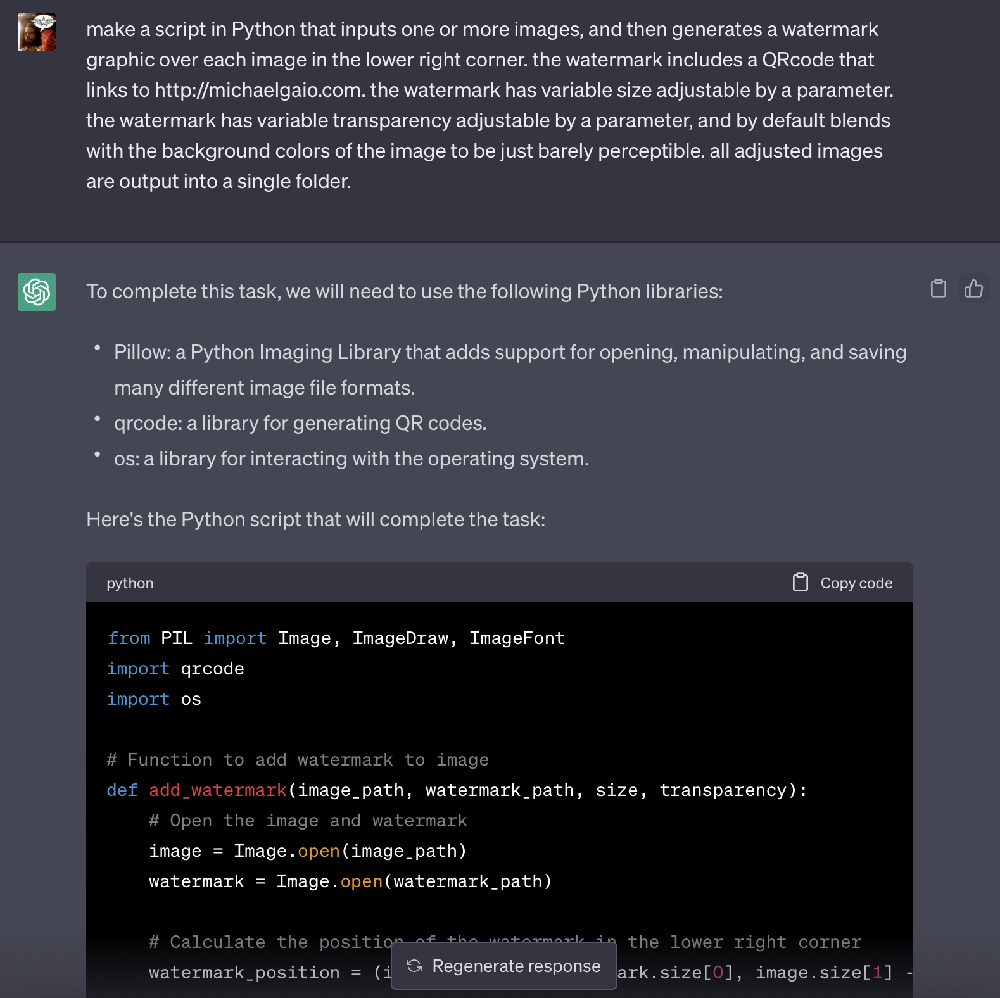

# AutoSIG
Automatically sign images with a png graphic watermark

## Install and run

Here are the steps to install and run the script:

1. Install Python: First, you need to install Python on your computer. You can download and install Python from the official website: https://www.python.org/downloads/

2. Install Pillow library: The script requires the Pillow library to work with images. You can install the library by running the following command in your terminal or command prompt: `pip install Pillow`

3. Prepare input and watermark images: Place your input images in a folder named `_input` and your watermark image in a folder named `_watermarks`. Make sure your watermark image has a transparent background and is in PNG format.

4. Update parameters: Open the script in a text editor and update the following parameters as needed:

   - `series_title`: The title of the series that the images belong to.
   - `watermark_path`: The path to the watermark image file.
   - `watermark_size`: The size of the watermark image.
   - `watermark_transparency`: The transparency level of the watermark image.
   - `x_adjustment`: The horizontal adjustment for the watermark position.
   - `y_adjustment`: The vertical adjustment for the watermark position.
   - `max_width`: The maximum width adjustment for the image.
   - `max_height`: The height width adjustment for the image.

5. Run the script: Open your terminal or command prompt, navigate to the directory where the script is located, and run the script by running the following command: `python3 autosig.py`

6. Check the output: The script will save the processed images with the watermark in a folder named `_output`. Check this folder to see the results.

### Features:

- Adds a PNG watermark to images in a specified folder
- Watermark size, transparency, x and y adjustments, and image size can be adjusted by changing parameters
- Input and output folders can be adjusted by changing parameters
- Watermark image can be changed by updating the watermark path parameter
- Supports JPEG and PNG image formats
- Saves the adjusted image with the "GAIO_" prefix and series title, number, and size.
- Adjusts the image size based on value of max_width and max_height (which ever is less), and maintains image aspect ratio.

Here are the steps and features of the code:

1. The script imports the necessary modules, including PIL, Image, ImageDraw, ImageFont, and os.

2. A number of parameters are set at the beginning of the script, including series_title, watermark_path, watermark_size, watermark_transparency, x_adjustment, y_adjustment, max_width, and max_height. These parameters control various aspects of the watermark and resizing process.

3. The script defines a function, add_watermark(), that adds a watermark to an image and appends the size of the image to the output filename. The function opens the input image and watermark, resizes them as necessary, adds transparency to the watermark, positions the watermark on the image, and saves the output image with a new filename that includes the size.

4. The script defines another function, resize_image_proportionally(), that resizes an image proportionally based on the max_width and max_height parameters.

5. The script gets a list of input files in the input_folder, sorts them alphabetically, and loops through them one by one.

6. For each input file, the script resizes the image based on the max_width and max_height parameters, adds the watermark to the image using the add_watermark() function, and increments the file number counter.

7. The output images are saved in the output_folder with a new filename that includes the original filename, the series title, the file number, and the size of the output image.

Overall, the code reads image files from an input folder, resizes them, adds a watermark to them, and saves new versions with a new name to an output folder.

### How it started:

I asked ChatGPT to make it.  Most of the script was complete and running within a few minutes. A few hours more went into adjusting, debuggin, and optimizing it ...

